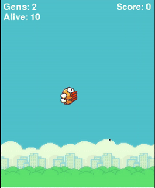

# FlappyBirdAI - Master Flappy Bird with NEAT Python



[](https://github.com/Techiral/Flappy-Bird-AI/stargazers)
[](https://github.com/Techiral/Flappy-Bird-AI/network/members)
[](https://github.com/Techiral/Flappy-Bird-AI/issues)
[](https://github.com/Techiral/Flappy-Bird-AI/blob/main/LICENSE)

## Overview
Welcome to **FlappyBirdAI**, an innovative project utilizing NEAT (NeuroEvolution of Augmenting Topologies) Python to teach an AI how to play Flappy Bird. This repository leverages a genetic algorithm to optimize neural network configurations through successive generations, enhancing the AI's performance over time.

## Project Features
- **Genetic Algorithms:** Uses NEAT Python for evolutionary learning.
- **Interactive Learning:** Watch the AI improve with each generation.
- **Detailed Visualization:** Real-time display of AI playing Flappy Bird.

## NEAT Python Documentation
Explore the comprehensive documentation for the NEAT module [here](https://neat-python.readthedocs.io/en/latest/).

## Reference Blog
For an in-depth understanding of how this project works, refer to this [blog post](https://medium.com/chris-nielsen/teaching-an-ai-to-play-flappy-bird-f0b18d65569b) by Chris Nielsen.

## Video Tutorial
Lakshya from Techiral offers a detailed tutorial on this project. Watch it on [YouTube](https://www.youtube.com/watch?v=OGHA-elMrxI).

## Repository Structure
- **CONFIG.txt:** Configuration file for NEAT.
- **FB.gif:** Animated demonstration of the AI playing Flappy Bird.
- **FBAI.py:** Main Python script containing the AI code.
- **README.md:** Project documentation.

## How to Run the Project
1. **Clone the repository:**
   ```bash
   git clone https://github.com/Techiral/Flappy-Bird-AI.git
   ```
2. **Navigate to the project directory:**
   ```bash
   cd Flappy-Bird-AI
   ```
3. **Install the required libraries:**
   ```bash
   pip install -r requirements.txt
   ```
4. **Run the script:**
   ```bash
   python FBAI.py
   ```

## Code Overview
The core of the project is the `FBAI.py` script, which uses Pygame for the game's graphical interface and NEAT for the evolutionary algorithm. Here's a brief overview of key components:

### Bird Class
Defines the behavior and properties of the bird, including movement, jumping, and drawing.

### Pipe Class
Manages the pipes' positions, movements, and collision detection.

### Base Class
Handles the moving base at the bottom of the screen.

### Main Functions
- **blitRotateCenter:** Rotates and blits images centered.
- **draw_window:** Draws the game window with the bird, pipes, and base.
- **eval_genomes:** Evaluate each generation of genomes.
- **run:** Sets up the NEAT configuration and runs the evolutionary process.

## Engage with Us
- **Star this repository** to show your support.
- **Fork this repository** to contribute and enhance the project.
- **Open issues** to report bugs or request features.

## Stay Connected
- Follow our [GitHub profile](https://github.com/Techiral) for more exciting projects.
- Subscribe to our [YouTube channel](https://www.youtube.com/@techiral?sub_confirmation=1) for tutorials and updates.

Elevate your coding skills by diving into the world of AI and evolutionary algorithms with FlappyBirdAI. Happy coding!
